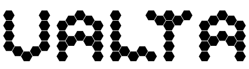

<div align="center">
    
    <div><strong>Fantasy 4X strategy game</strong></div>
</diV>

## dev start

```sh
yarn install
yarn data
./node_modules/.bin/knex migrate:latest --env index-server-development
./node_modules/.bin/knex migrate:latest --env game-server-development

# each in different shell
yarn index-server
yarn game-server
yarn client:dev
```
